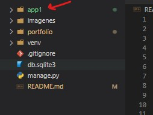
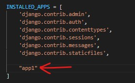
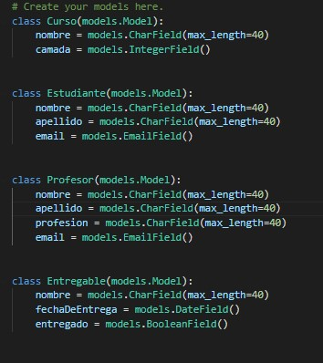
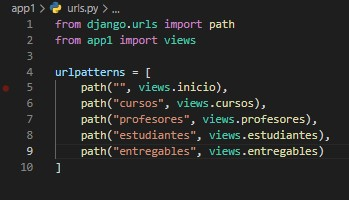
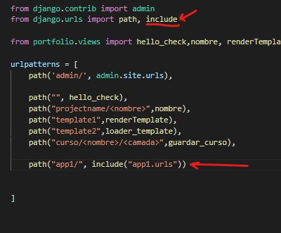
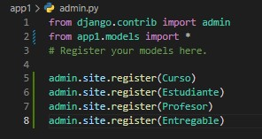
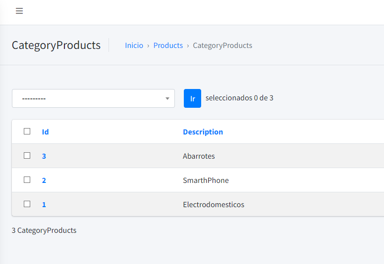
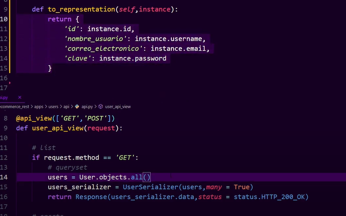
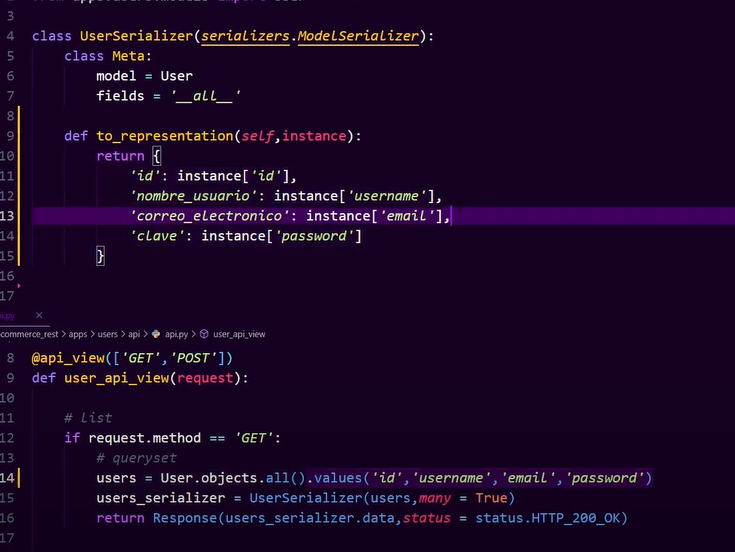

# DJANGO REST FRAMEWORK

## Credenciales
- sharid
- sha0503

## Documentación
https://www.cdrf.co

## Ambiente virutal y Settings
```powershell
# creamos entorno virtual
python -m virtualenv venv

# activamos el entorno virtual
.\venv\Scripts\activate

# instalamos django en el entorno
pip install django

# creamos el project
django-admin startproject [projecto] .
```

## Primeros pasos
```powershell
# Registramos los cambios para las migraciones
python manage.py makemigrations

# realizamos las migraciones predeterminadas sqlite
python manage.py migrate

# Corremos el servidor
python manage.py runserver
```

## Desplegar Django en docker
### Dockerfile
````dockerfile
FROM python:3.8
WORKDIR /app/socias
COPY . .
RUN pip install -r requirements.txt
EXPOSE 8000
CMD [ "python","manage.py","runserver","0.0.0.0:8000" ]
````
### modificar setting.py
````python
# settings.py
...
ALLOWED_HOSTS = ["x.x.x.x","dns.com"]
...
````

### Database Configuration
````python
# [DATABASE]
# 'django.db.backends.postgresql' (pip install psycopg2)
# 'django.db.backends.mysql' (pip install mysql-connector-python)
# https://dev.mysql.com/downloads/connector/python/
# 'django.db.backends.sqlite3'
# 'django.db.backends.oracle'

DATABASES = {
    'default': {
        'ENGINE': 'django.db.backends.[DATABASE]',
        'NAME': 'mydatabase',
        'USER': 'mydatabaseuser',
        'PASSWORD': 'mypassword',
        'HOST': '127.0.0.1',
        'PORT': '5432',
    },
    'database2': {
        'ENGINE': 'django.db.backends.[DATABASE]',
        'NAME': 'mydatabase',
        'USER': 'mydatabaseuser',
        'PASSWORD': 'mypassword',
        'HOST': '127.0.0.1',
        'PORT': '5432',
    }
}
````
Para ejecutar comando sobre diferentes bases de datos, recordar que el ````manage.py makemigrations```` se hace en general, no por base de datos.
```bash
python manage.py migrate --database=default
python manage.py migrate --database=database2
```

## Creamos una app.
- A la altura de ```manage.py``` escribimos el comando ```python manage.py startapp [App]```.
- Luego nos dirigimos a ```settings.py``` en INSTALLED_APPS agregamos nuestra app.
- 
- 

## Creación de un modelo.
- Entramos al archivo ```models.py``` dentro de nuestra aplicación.
- Creamos nuestros modelos extendiendo la clase ```models``` de ```django.db```.
- 
- Para hacer las migraciones debemos escribir el comando ```python manage.py makemigrations```.
- Para aplicar las migraciones ```python manage.py migrate```.


### Generar URLs desde una APP.
- Entramos a la carpeta de nuestra APP.
- Creamo un archivo llamado ```urls.py``` y agregamos las vistas.
- 
- Luego nos dirigimos al archivo ```[projecto]/urls.py``` de nuestro proyecto principal e incluimos las rutas.
- 

### Crear un superUsuario Admin:
- ```python manage.py createsuperuser```.
- Para gestionar modelos en el panel de administración, se deben agregar en el archivo de ```admin.py``` dentro de la app.
- 

### Modificar vista del modelo en admin
Se crea una clase y en el ``list_display`` como tupla se pasan los varlores que se quieren mostrar
```py
class AdminView(admin.ModelAdmin):
    list_display = ("id","description")

admin.site.register(MeasureUnit,AdminView)
admin.site.register(CategoryProduct,AdminView)
admin.site.register(Indicator)
admin.site.register(Product)
```


## Configuration
### django-jazzmin
- Install the latest pypi release with ````pip install -U django-jazzmin````
- Add ````jazzmin```` to your ````INSTALLED_APPS```` before ````django.contrib.admin````.
```python
INSTALLED_APPS = [
    'jazzmin',
    'django.contrib.admin',
    [...],
    'rest_framework'
]
```
### Django-jazzmin full example
To configure the general behaviour of ````jazzmin````, you can use ````JAZZMIN_SETTINGS```` within your django ````settings````, below is a full example, with some of the more complex items explained below that.
```python
JAZZMIN_SETTINGS = {
    # title of the window (Will default to current_admin_site.site_title if absent or None)
    "site_title": "Library Admin",

    # Title on the login screen (19 chars max) (defaults to current_admin_site.site_header if absent or None)
    "site_header": "Library",

    # Title on the brand (19 chars max) (defaults to current_admin_site.site_header if absent or None)
    "site_brand": "Library",

    # Logo to use for your site, must be present in static files, used for brand on top left
    "site_logo": "books/img/logo.png",

    # Logo to use for your site, must be present in static files, used for login form logo (defaults to site_logo)
    "login_logo": None,

    # Logo to use for login form in dark themes (defaults to login_logo)
    "login_logo_dark": None,

    # CSS classes that are applied to the logo above
    "site_logo_classes": "img-circle",

    # Relative path to a favicon for your site, will default to site_logo if absent (ideally 32x32 px)
    "site_icon": None,

    # Welcome text on the login screen
    "welcome_sign": "Welcome to the library",

    # Copyright on the footer
    "copyright": "Acme Library Ltd",

    # The model admin to search from the search bar, search bar omitted if excluded
    "search_model": "auth.User",

    # Field name on user model that contains avatar ImageField/URLField/Charfield or a callable that receives the user
    "user_avatar": None,

    ############
    # Top Menu #
    ############

    # Links to put along the top menu
    "topmenu_links": [

        # Url that gets reversed (Permissions can be added)
        {"name": "Home",  "url": "admin:index", "permissions": ["auth.view_user"]},

        # external url that opens in a new window (Permissions can be added)
        {"name": "Support", "url": "https://github.com/farridav/django-jazzmin/issues", "new_window": True},

        # model admin to link to (Permissions checked against model)
        {"model": "auth.User"},

        # App with dropdown menu to all its models pages (Permissions checked against models)
        {"app": "books"},
    ],

    #############
    # User Menu #
    #############

    # Additional links to include in the user menu on the top right ("app" url type is not allowed)
    "usermenu_links": [
        {"name": "Support", "url": "https://github.com/farridav/django-jazzmin/issues", "new_window": True},
        {"model": "auth.user"}
    ],

    #############
    # Side Menu #
    #############

    # Whether to display the side menu
    "show_sidebar": True,

    # Whether to aut expand the menu
    "navigation_expanded": True,

    # Hide these apps when generating side menu e.g (auth)
    "hide_apps": [],

    # Hide these models when generating side menu (e.g auth.user)
    "hide_models": [],

    # List of apps (and/or models) to base side menu ordering off of (does not need to contain all apps/models)
    "order_with_respect_to": ["auth", "books", "books.author", "books.book"],

    # Custom links to append to app groups, keyed on app name
    "custom_links": {
        "books": [{
            "name": "Make Messages", 
            "url": "make_messages", 
            "icon": "fas fa-comments",
            "permissions": ["books.view_book"]
        }]
    },

    # Custom icons for side menu apps/models See https://fontawesome.com/icons?d=gallery&m=free&v=5.0.0,5.0.1,5.0.10,5.0.11,5.0.12,5.0.13,5.0.2,5.0.3,5.0.4,5.0.5,5.0.6,5.0.7,5.0.8,5.0.9,5.1.0,5.1.1,5.2.0,5.3.0,5.3.1,5.4.0,5.4.1,5.4.2,5.13.0,5.12.0,5.11.2,5.11.1,5.10.0,5.9.0,5.8.2,5.8.1,5.7.2,5.7.1,5.7.0,5.6.3,5.5.0,5.4.2
    # for the full list of 5.13.0 free icon classes
    "icons": {
        "auth": "fas fa-users-cog",
        "auth.user": "fas fa-user",
        "auth.Group": "fas fa-users",
    },
    # Icons that are used when one is not manually specified
    "default_icon_parents": "fas fa-chevron-circle-right",
    "default_icon_children": "fas fa-circle",

    #################
    # Related Modal #
    #################
    # Use modals instead of popups
    "related_modal_active": False,

    #############
    # UI Tweaks #
    #############
    # Relative paths to custom CSS/JS scripts (must be present in static files)
    "custom_css": None,
    "custom_js": None,
    # Whether to show the UI customizer on the sidebar
    "show_ui_builder": False,

    ###############
    # Change view #
    ###############
    # Render out the change view as a single form, or in tabs, current options are
    # - single
    # - horizontal_tabs (default)
    # - vertical_tabs
    # - collapsible
    # - carousel
    "changeform_format": "horizontal_tabs",
    # override change forms on a per modeladmin basis
    "changeform_format_overrides": {"auth.user": "collapsible", "auth.group": "vertical_tabs"},
    # Add a language dropdown into the admin
    "language_chooser": True,
}
```` 
---
---

### Project Settings
- Dentro del proyecto creamos una carpeta llamada ```settings.py```.
- Dentro de ````settings.py```` creamos tres archivos : ````base.py````, ````local.py```` y ````production.py````.
- Separamos las configuraciones base de las configuraciones de ````local```` y ````production````, las cuales son : **DEBUG**, **ALLOWED_HOSTS**, **DATABASES**,**STATIC_URL**.
- Luego entramos a ````wsgi.py```` y ````asgi.py```` y en la configuración colocamos en la que estemos trabajando ````os.environ.setdefault('DJANGO_SETTINGS_MODULE', 'project.settings.local.py')````


## Modelo de Usuario
````py
from django.db import models
from django.contrib.auth.models import BaseUserManager, AbstractBaseUser, PermissionsMixin
from simple_history.models import HistoricalRecords # se puede quitar


class UserManager(BaseUserManager):
    def _create_user(self, username, email, name,last_name, password, is_staff, is_superuser, **extra_fields):
        user = self.model(
            username = username,
            email = email,
            name = name,
            last_name = last_name,
            is_staff = is_staff,
            is_superuser = is_superuser,
            **extra_fields
        )
        user.set_password(password)
        user.save(using=self.db)
        return user

    def create_user(self, username, email, name,last_name, password=None, **extra_fields):
        return self._create_user(username, email, name,last_name, password, False, False, **extra_fields)

    def create_superuser(self, username, email, name,last_name, password=None, **extra_fields):
        return self._create_user(username, email, name,last_name, password, True, True, **extra_fields)

class User(AbstractBaseUser, PermissionsMixin):
    username = models.CharField(max_length = 255, unique = True)
    email = models.EmailField('Correo Electrónico',max_length = 255, unique = True,)
    name = models.CharField('Nombres', max_length = 255, blank = True, null = True)
    last_name = models.CharField('Apellidos', max_length = 255, blank = True, null = True)
    image = models.ImageField('Imagen de perfil', upload_to='perfil/', max_length=255, null=True, blank = True)
    is_active = models.BooleanField(default = True)
    is_staff = models.BooleanField(default = False)
    historical = HistoricalRecords() # se puede quitar
    objects = UserManager()

    class Meta:
        verbose_name = 'Usuario'
        verbose_name_plural = 'Usuarios'

    USERNAME_FIELD = 'username'
    REQUIRED_FIELDS = ['email','name','last_name']

    def __str__(self):
        return f'{self.name} {self.last_name}'
````

### Enlazar modelo de usarios
Para enlazar modelo de usuarios con la aplicación admin, se debe colocar lo siguiente en el archivo de configuraciones.
 ````py
 # settings.py
AUTH_USER_MODEL = 'users.User'
````
Y se coloca en admin de la aplicación

````py
from django.contrib import admin
from .models import User

# Register your models here.
admin.site.register(User)
````

## APIs
### APIViews
```python
#api.py
from rest_framework.response import Response
from rest_framework.views import APIView
from apps.users.models import User
from apps.users.api.serializers import UserSerializer

class UserAPIView(APIView):
    
    def get(self,request):
        users = User.objects.all()
        user_serializer = UserSerializer(
            users,
            many = True
        )
        return Response(
            data = user_serializer.data
        )
```
```python
#urls.py
from django.urls import path
from apps.users.api.api import UserAPIView

urlpatterns = [
    path('usuario/',UserAPIView.as_view(), name='usuario_api')
]

```


### @api_view
```python 
#api.py
from rest_framework.response import Response
from rest_framework.decorators import api_view
from apps.users.models import User
from apps.users.api.serializers import UserSerializer

@api_view(["GET"])
def user_api_view(request):
    
    if request.method == "GET":
        users = User.objects.all()
        user_serializer = UserSerializer(
            users,
            many = True
        )
        return Response(
            user_serializer.data
        )
```
```python
#urls.py
from django.urls import path
from apps.users.api.api import user_api_view

urlpatterns = [
    path('usuario/',user_api_view, name='usuario_api')
]

```

## Serializadores
Los serializadores nos permiten convertir un JSON en un objeto que pueda ser procesado por la base de datos y viceversa
```python 
from rest_framework import serializers
from apps.users.models import User

class UserSerializer(serializers.ModelSerializer):
    class Meta:
        model = User
        fields = '__all__'
        # exclude = []


class TestUSerSerializer(serializers.Serializer):
    name = serializers.CharField(max_length = 200)
    email = serializers.EmailField()
    
    def validate_name(self,value):
        # Custom validation
        print(value)
        print(self.context)
        if "test" in value:
            raise serializers.ValidationError("error, no puede existir un usuario con ese nombre")
        return value
    
    def validate_email(self,value):
        # Custom validation
        print(value)
        
        if value == "":
            raise serializers.ValidationError("email no puede ir vacio")
        
        # podemos llamar otros validadores
        # if self.validate_name(self.context["name"]) in value:
        #     raise serializers.ValidationError("El email no puede contener el nombre")
            
        return value
    
    def validate(self,data):
        # Esto lanza un error sin campo
        # if data["name"] in data["email"]:
        #     raise serializers.ValidationError("El email no puede contener el nombre")
        print(data)
        return data
    
    # def create(self,validate_data):
    #     return self.[model].object.create(**validate_data)
    
    # def update(self, instance, validated_data):
    #     instance.name = validated_data.get("name",instance.name)
    #     instance.email = validated_data.get("email",instance.email)
    #     instance.save()
    #     return instance
    
    def save(self):
        print(f"impresión de instancia: {self}")

```

### Validaciones:
Los serializadores tienen diferentes validadores, algunos vienen por defecto cuando se enlazan con el modelo, pero estos validadores se pueden rescribir.
```python
# Definición del serializador
class TestUSerSerializer(serializers.Serializer):
    name = serializers.CharField(max_length = 200)
    email = serializers.EmailField()

    def validate_email(self,value):
        # Custom validation
        print(value)
        if value == "":
            # levantamiento de error en caso de validador
            raise serializers.ValidationError("email no puede ir vacio")
            # sí se cumple el validador, este error saldrá en la respuesta al JSON
        
        # podemos llamar otros validadores
        if self.validate_name(self.context["name"]) in value:
            raise serializers.ValidationError("El email no puede contener el nombre")

    # Función que valida la data en general
    def validate(self,data):
        # puedo hacer valores
        print(data["name"])
        print(data["email"])
        ...
        return validate_data
```

### Metodo Create:
Cuando uno esta trabajando con serializadores, despues de usar el metodo validate, uno usa el metodo create, el cual guarda en base de datos, pero esta función internamente llama al ORM de Django.
```python
# Definición del serializador
class TestUSerSerializer(serializers.Serializer):
    ...
    # Función que valida la data en general
    def validate(self,data):
        ...
        return validate_data

    # "self.model" debe ser un modelo creado
    def create(self,validate_data):
        # se tiene que pasar el modelo para guardar
        #return self.model.objects.create(**validate_data)
        return User.model.objects.create(**validate_data)
```


### Metodo Update:
```python
# Definición del serializador
class TestUSerSerializer(serializers.Serializer):
    ...
    # Función que valida la data en general
    def validate(self,data):
        ...
        return validate_data

    # "self.model" debe ser un modelo creado
    def create(self,validate_data):
        ...
    
    # llamado cuando se define un objeto de serializador
    # con (instance= , data= )
    def update(self,instance, validate_data):
        # recorre la instancia asignandole el nuevo valor 
        # de validate_data
        # Esto por cada atributo de la instancia, definido en los fields
        instance.[field] = validate_data.get("[field]",instance.[field])
        instance.save()
        return instance
```

### Metodo save:
```python
# Definición del serializador
class TestUSerSerializer(serializers.Serializer):
    ...

    def validate(self,data):
        ...
        return validate_data

    def create(self,validate_data):
        ...
    
    def update(self,instance, validate_data):
        ...
    
    # aqui se pueden hacer operaciones que se tengan que ejecutar cuando
    # se registra un dato en la base de datos,
    # un envio de notificación, envio de correo, confirmación.
    # También puedo redistribuirlo en otro modelo.
    def save(self):
        # podemos acceder a "validated_data"
        # ya que hace parte del mismo obejto
        # podemos agregar funciones como:
        # envio de correo, envio de celular mensajes
        print(self.validated_data)
```


### Anotaciones:
```python
@api_view(["POST","GET","PU"])
def testing_api_view(request,pk=None):
    # hacemos get del objeto
    # user = User.objects.filter(id=pk).first()

    if request.method == "GET":
        # solo se para el objeto
        # user = User.objects.all()
        user = User.objects.filter(id=pk).first()
        user_serializer = UserSerializer(
            user,
            many=True|False
        )
    
    elif request.method == "POST":
        # se usa el "data ="
        user_serializer = UserSerializer(data=request.data,
        context=request.data)
        if user_serializer.is_valid():
            user_serializer.save()
            return Response(...)
        return Response(
            user_serializer.errors,
            status= status.HTTP_400_BAD_REQUEST
        )   

    elif request.method == "PUT":
        user = User.objects.filter(id=pk).first()
        # Se pasa el modelo y el data
        user_serializer = UserSerializer(user, data=request.data)
        if user_serializer.is_valid():
            user_serializer.save()
            return Response(...)
        return Response(
            user_serializer.errors,
            status= status.HTTP_400_BAD_REQUEST
        )   

    elif request.method == "DELETE":
        # se
        try:
            user = User.objects.filter(id=pk).first()
            user.delete()
            return Response(...)
        except:
            return Response(
            user_serializer.errors,
            status= status.HTTP_400_BAD_REQUEST
        )   
    
```

#### diferencia serializador GET, POST, PUT
La diferencia entre los metodos GET PUT POST para los serializadores
````py 
    if request.method == "GET":
        # solo se para el objeto
        # user = User.objects.all()
        user = User.objects.filter(id=pk).first()
        # Solo se pasa la consulta
        user_serializer = UserSerializer(user,many=True|False)
                return Response(... )

    elif request.method == "POST":
        # se usa el "data ="
        user_serializer = UserSerializer(data=request.data)
        # Luego se guarda
        if user_serializer.is_valid():
            user_serializer.save()
            return Response(...)

    elif request.method == "PUT":
        user = User.objects.filter(id=pk).first()
        # Se pasa la consulta y la data
        user_serializer = UserSerializer(user, data=request.data)
        if user_serializer.is_valid():
            user_serializer.save()
            return Response(...)
````

---

## MODELOS

### Metodo .save()
````python 
class ...(models.Model):
    ...

    # podemos agregar logica al momento de guardar la instancia.
    def save(self,*args,**kwargs):
        ...
````

## To Representation
Si tenemos un Serializado basado en un modelo, pero necesitamos que se actualicen todos los campos, pero no queremos devolver todos los campos, en el response, un buen metodo podría ser el de crear un serializador para crear, uno para actualizar y otro para listar.

Pero si queremos una solución más compacta, seria el de reescribir el metodo de "to_representation" del serializador.
````python 
class UserSerializer(serializers.ModelSerializer):
    class Meta:
        model = User
        fields = '__all__' # para crear o actualizar (base de datos)
        # exclude 


# función solo para listar (solo la representación)
    def to_representation(self, instance):
        # Tambien podemos reenombrar el key del diccionario a devolver
        return {
            "id":instance["id"],
            "username":instance["id"],
            "email": instance["email"],
            "password":instance["password"]
        }
````

- Se puedes consultar todos los campos de la BBDD pero solo mostrar algunos, en el to_representation debe ser llamado como atributos

- Cuando se quiere traer solo unos cuantos valores de la BBDD, se coloca ````.values("","","","")```` al momento de hacer la consulta, pero el to_representation debe ser llamado como un diccionario.


## Serializador de Relaciones 
Para serializar las llaves foraneas y que no se vean los Ids, puedes ser 3 metodos.

***Los campos deben llamarse iguales de como estan en el modelo.***

### Metodo 1 
```py
class ProductSerializer(serializers.ModelSerializer):
    # se sobre escribe el campo del serializador y se muestra todo el serializador
    measure_unit = MeasureUnitSerializer()
    category_product = CategoryProductSerializer()
    
    class Meta:
        model = Product
        exclude = ("state",)
```

### Metodo 2
```py
class ProductSerializer(serializers.ModelSerializer):
    # Se sobre escribe el campo del serializador mostrando lo que está en el __str__
    # No funciona en la interfaz
    measure_unit = serializers.StringRelatedField()
    category_product = serializers.StringRelatedField()
    
    class Meta:
        model = Product
        exclude = ("state",)
```

### Metodo 3
```py
class ProductSerializer(serializers.ModelSerializer):
    
    class Meta:
        model = Product
        exclude = ("state",)
    
    def to_representation(self, instance):
        return {
            "id": instance.id,
            "description":instance.description,
            # modificando el metodo to_representation y entran al atributo
            # del campo de la llave foranea
            "measure_unit": instance.measure_unit.description,
            "category_product":instance.category_product.description
        }
```


## ENCRIPTAR contraseña en un SERIALIZER
Para encriptar la constraseña se debe modificar el metodo save y update del serializer para que este al momento de llamar el metodo .save() del modelo, este pase la constraseña ya encriptada.

````python
from rest_framework import serializers
from apps.users.models import User

class UserSerializer(serializers.ModelSerializer):
    class Meta:
        model = User
        fields = '__all__'
    
    def create(self, validated_data):
        user = User(**validated_data)
        user.set_password(validated_data["password"])
        user.save()
        return user
    
    def update(self,instance,validated_data):
        updated_user = super().update(instance, validated_data)
        updated_user.set_password(validated_data["password"])
        updated_user.save()
        return updated_user
````


## Vistas genericas


### ListAPIView (GET-List)
La forma general de como se define la vista de la clase ListAPIView, es la siguiente:
- Se define el *````````serializer_class````````
- se sobre escrible la función ````get_queryset ````
````python
from rest_framework import generics

class MeasureUnitList(generics.ListAPIView):
    serializer_class = MeasureUnitSerializer # Serializador
    
    def get_queryset(self):
        return MeasureUnit.objects.filter(state = True) # Modelo
````
---
Este proceso se puede abstraer, creando una clase general, la cual se puede llamar cada vez que se va hacer una ListAPIView
```python
from rest_framework import generics

class GeneralListAPIView(generics.ListAPIView):
    serializer_class = None # se coloca como None, pero se sobre-escribirá
    
    def get_queryset(self):
        model = self.get_serializer().Meta.model # obtenemos el modelo del serializador
        return model.objects.filter(state = True)
```

Ahora podemos llamar esa clase y solo pasarle el serializador 
```py
from apps.base.api import GeneralListAPIView

class MeasureUnitListAPIView(GeneralListAPIView):
    serializer_class = MeasureUnitSerializer # Serializador
```

Para mostrarlo como url
````python
from django.urls import path
from apps.products.api.views.general_view import MeasureUnitListAPIView

urlpatterns = [
    path("maesure_unit/", MeasureUnitListAPIView.as_view(), name="measure_unit")   
]
````

### CreateAPIView (POST)
```py
class ProductCreateAPIView(generics.CreateAPIView):
    serializer_class = ProductSerializer

# se puede sobre-escribir el metodo POST
    def post(self, request):
        serializer = self.serializer_class(data=request.data)
        if serializer.is_valid():
            serializer.save()
            return Response({
                "message":"Producto creado correctamente",
                "data":request.data
                }
            )
        return Response(serializer.errors)
```

### RetrieveAPIView (GET) get by id
```py
class ProductRetrieveAPIView(generics.RetrieveAPIView):
    serializer_class = ProductSerializer

    def get_queryset(self):
        return self.get_serializer().Meta.model.objects.filter(state = True)
```
Se debe colocar la ruta de la siguiente forma
```py
# Busca por pk
path("products/retrieve/<int:pk>",ProductRetrieveAPIView.as_view(), name="product_retrieve")
```


### DestroyAPIView
```py
class ProductDestroyAPIView(generics.DestroyAPIView):
    serializer_class = ProductSerializer
    def get_queryset(self):
        return self.get_serializer().Meta.model.objects.filter(state = True)

    def delete(self,request,pk=None):
        product = self.get_queryset().filter(id = pk).first()
        if product:
            product.state = False
            product.save()
            return Response({"message":"Producto eliminado correctamente","data":product.product})
        return Response({"message":"Producto no encontrado"})
```
Se debe colocar la ruta de la siguiente forma
```py
# Busca por pk
path("products/destroy/<int:pk>",ProductDestroyAPIView.as_view(), name="product_destroy"),
```

### UpdateAPIView (PUT,PATCH)
```py
class ProductUpdateAPIView(generics.UpdateAPIView):
    serializer_class = ProductSerializer
    
    def get_queryset(self):
        return self.get_serializer().Meta.model.objects.filter(state = True)
    
    # Se puede sobre escribir el patch
    def patch(self, request, pk=None):
        product = self.get_queryset().filter(id = pk).first()
        if product:
            product_serializer = self.serializer_class(product)
            return Response(product_serializer.data, status="200")
        return Response({"message":"Producto no encontrado"})
```